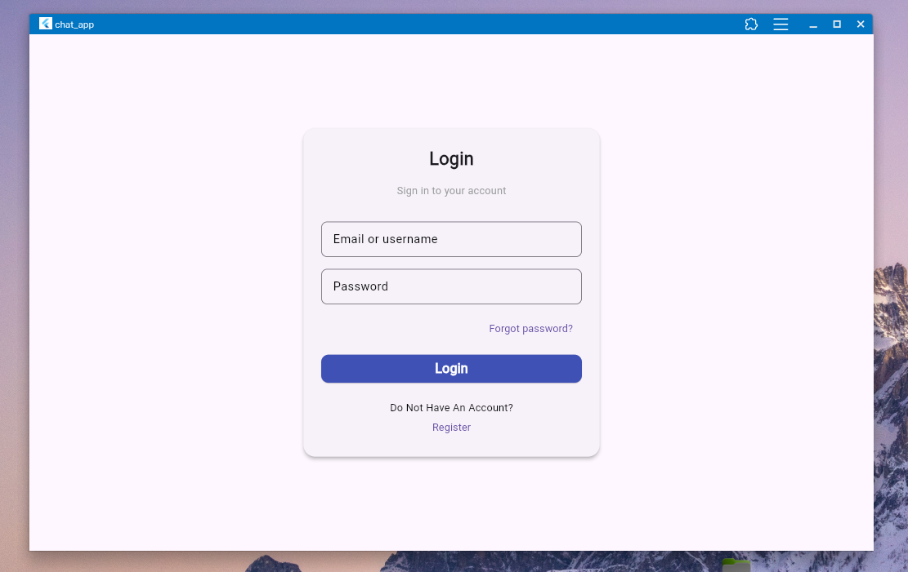
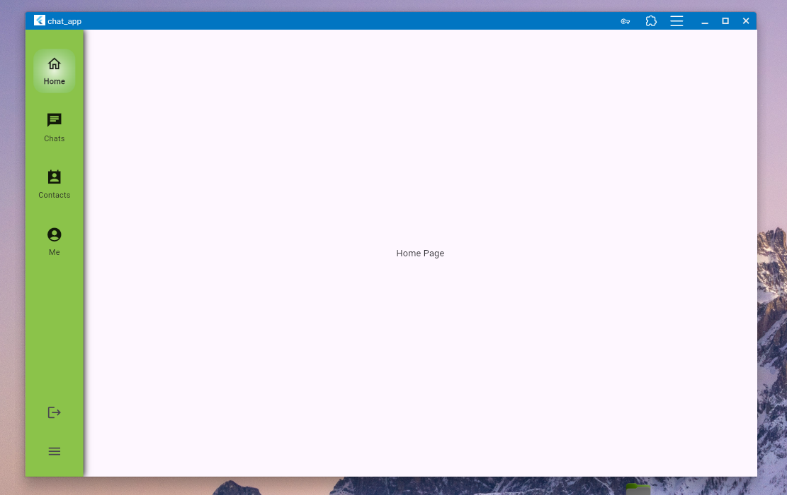
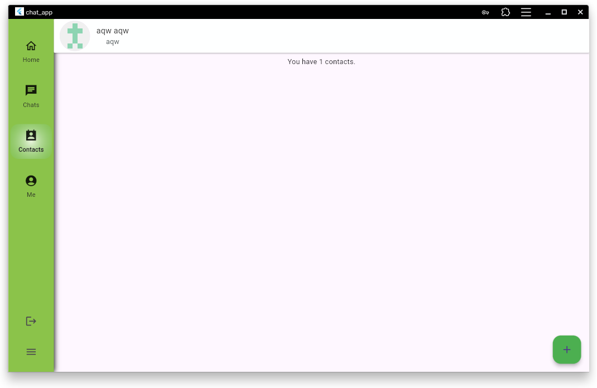
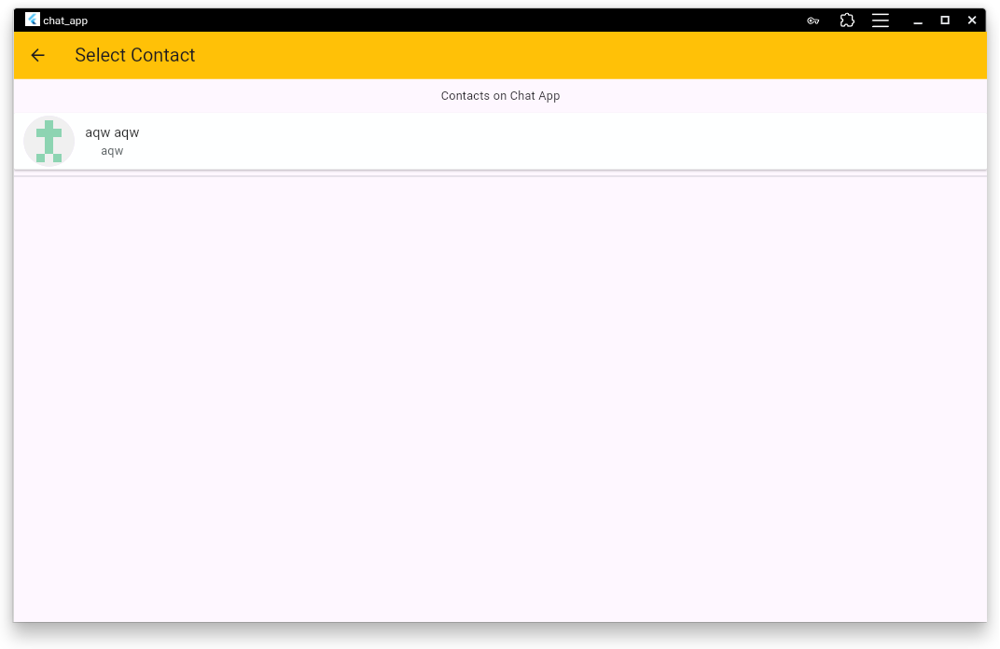
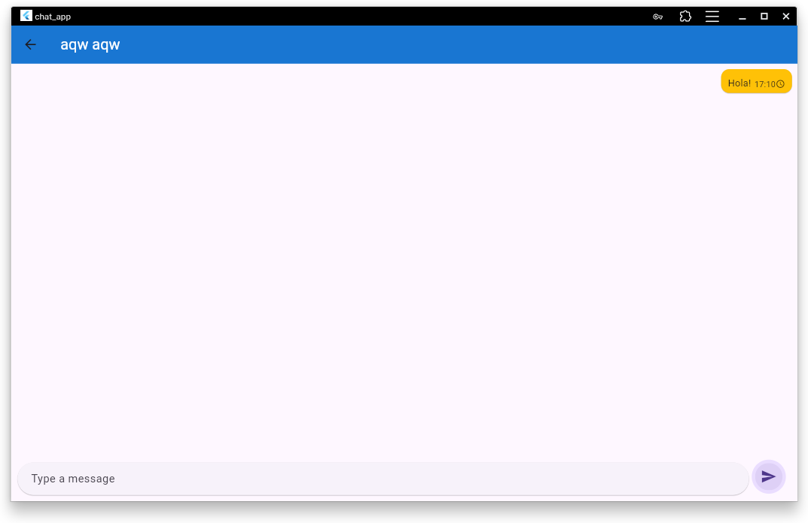

# Chat App

A Flutter-based real-time chat application.

<p align="center">
  
  
</p>
<p align="center">
  
  
</p>
<p align="center">
  
</p>


```bash
dart run drift_dev schema dump lib/data/database/database.dart drift_schemas/
flutter pub upgrade drift_dev build_runner
flutter clean && flutter pub get && flutter run -d chrome

flutter pub run build_runner build --delete-conflicting-outputs
flutter pub run build_runner build
```
